# DATASET_MANAGER
一款基于pyqt5、yolo为基础的开源可视化数据标注工具

## 功能说明

### 1. 文件管理
支持多数据集管理，文件搜索，回收站撤消误删文件等功能

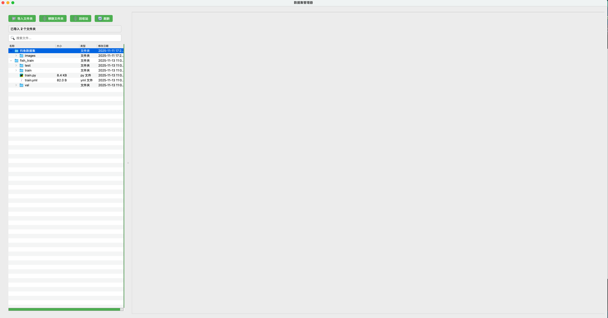

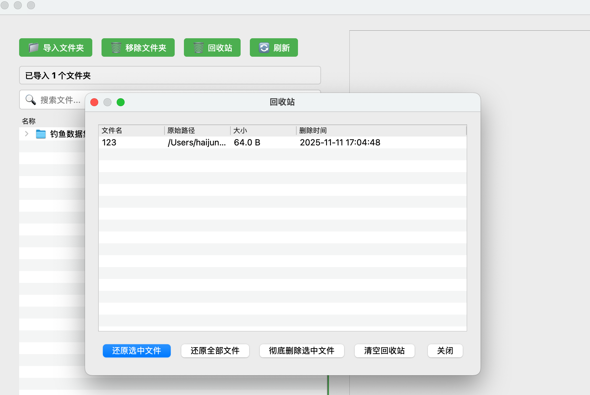

支持右键直接上传文件到服务器

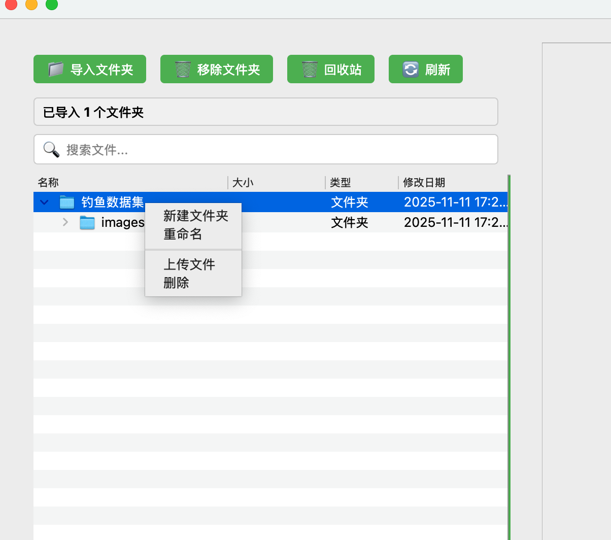

### 2. 文件预览

支持文件预览的格式为：

- 视频：mp4、avi、mov、wmv、flv、mkv
- 图片：jpg、jpeg、png、bmp、gif
- 文本：txt、json、xml、py、yaml、yml

支持视频资源自动抽帧与W按键截图功能

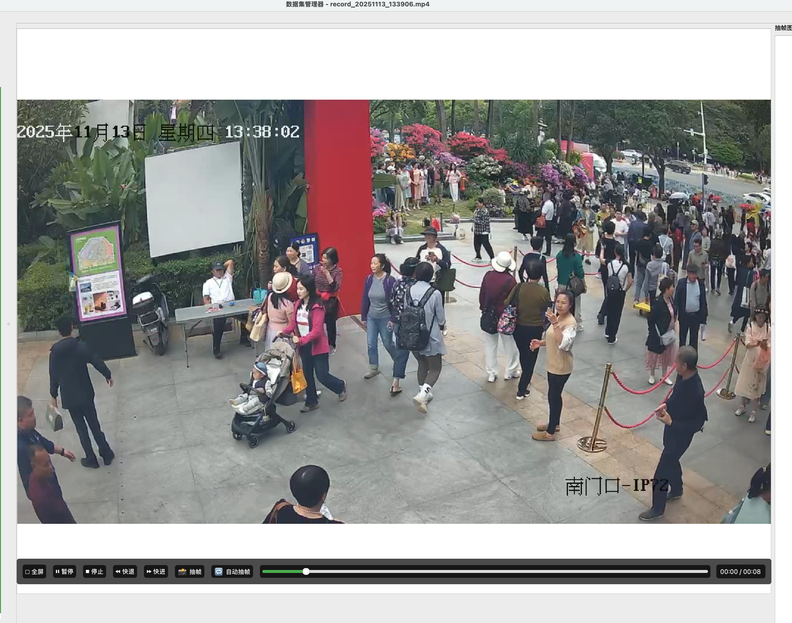

直接预览资源使用Delete键删除数据功能

### 3. 图片标注

支持全局标注模式，W键开启，标注数据将会保存到当前图片同路径下，支持矩形和多边形进行标注

### 4. 自动标注

模型支持自动标注借助大模型与yolo框架的模型

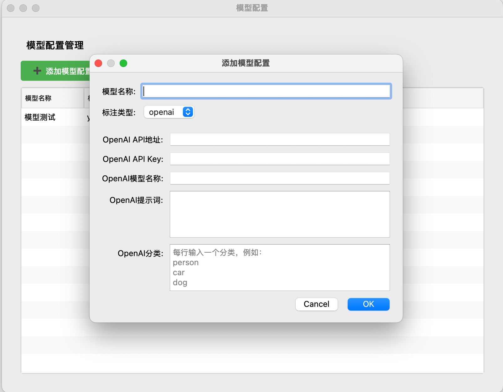

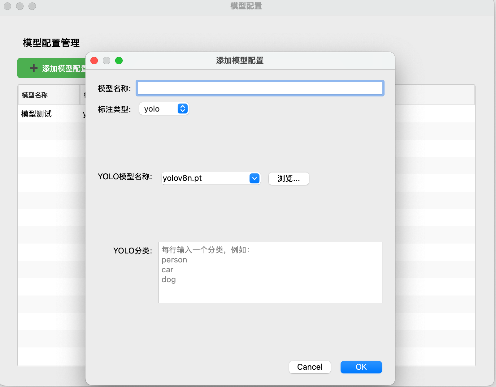

### 5. 远程文件管理

支持文件上传，文件下载功能

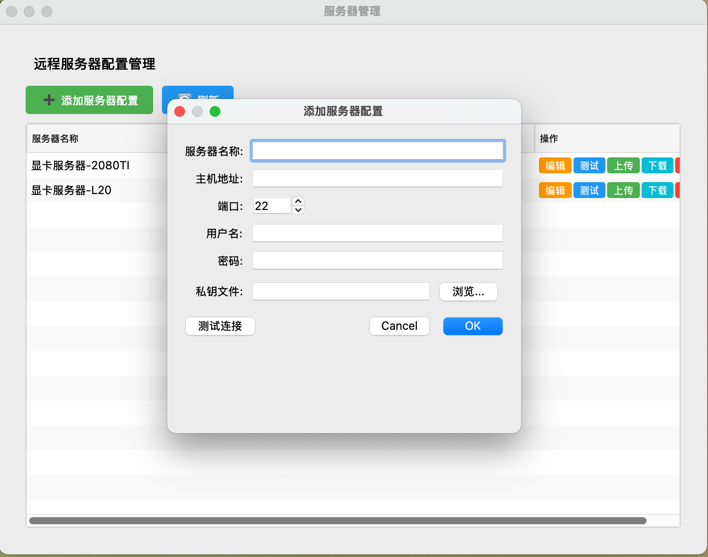

支持远程服务器文件编辑功能

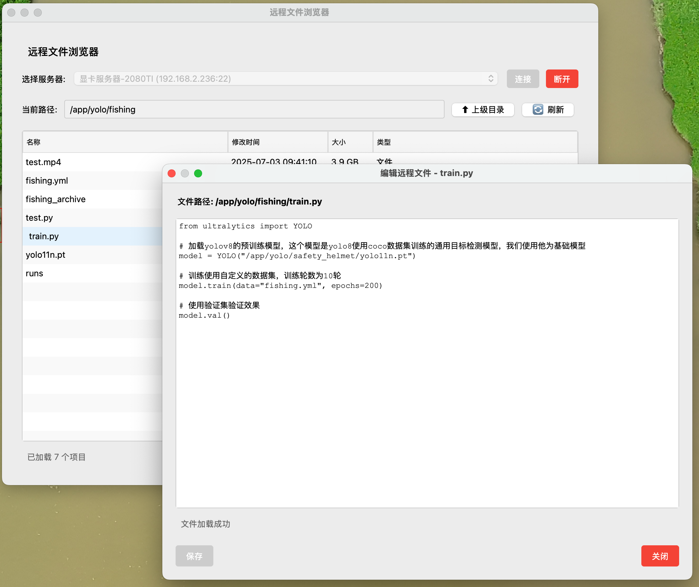

### 6. 数据源

支持rtmp、rtsp协议的直播源播放，支持录制直播视频截屏并且保存数据到指定位置

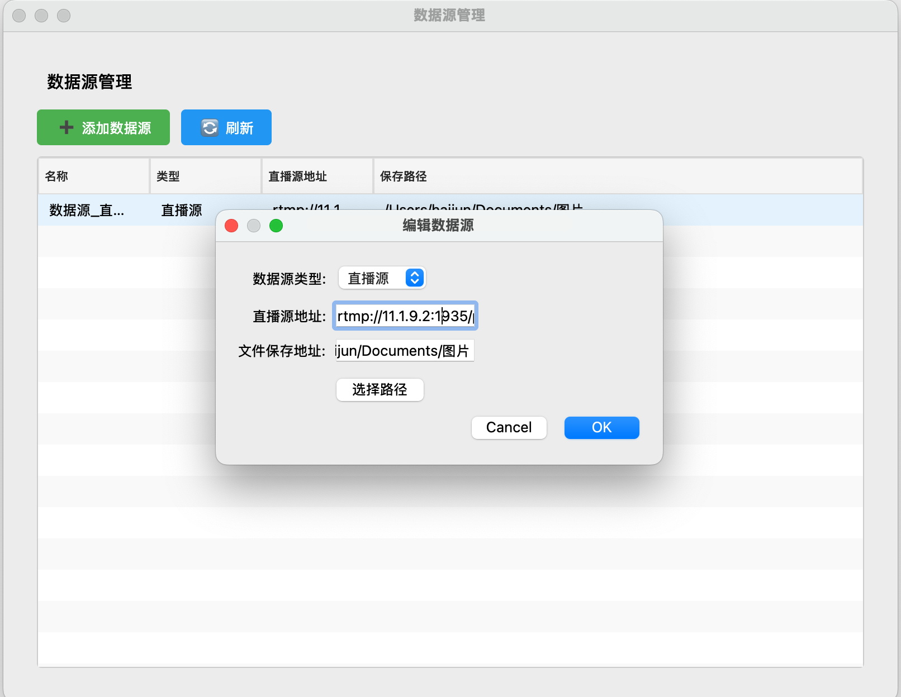

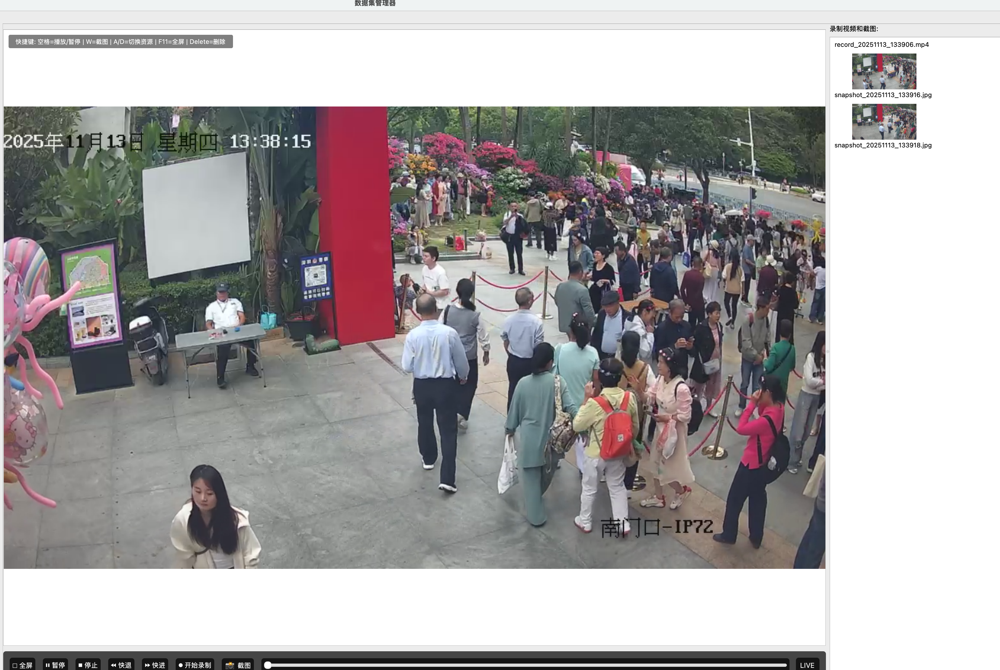

### 7. 模型训练

模型训练支持自动对数据集进行划分按照比例，并且生成对应的训练脚本和训练配置

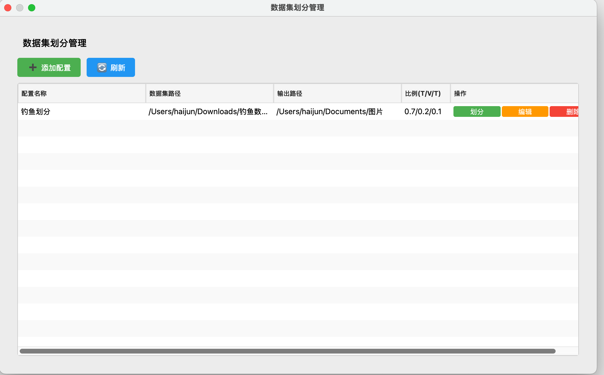

### 8. 模型测试

支持右键选中文件直接进行训练好的算法模型测试

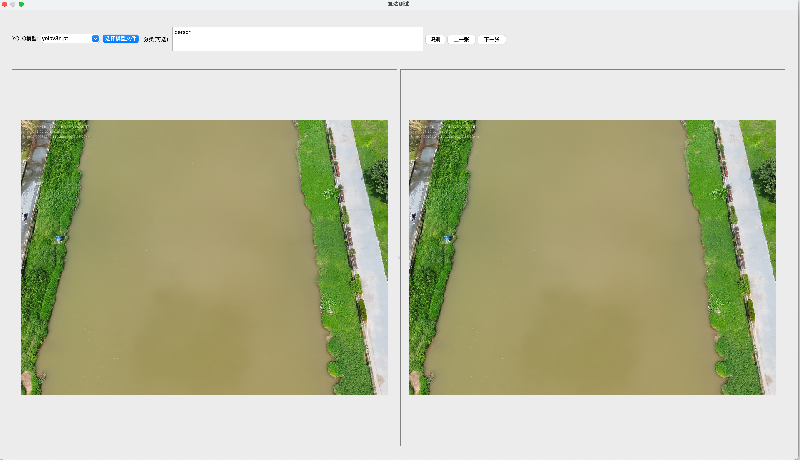

### 9. 日志分析

支持选择yolo训练过程输出的csv格式文件，进行解析后展示对应的数据指标

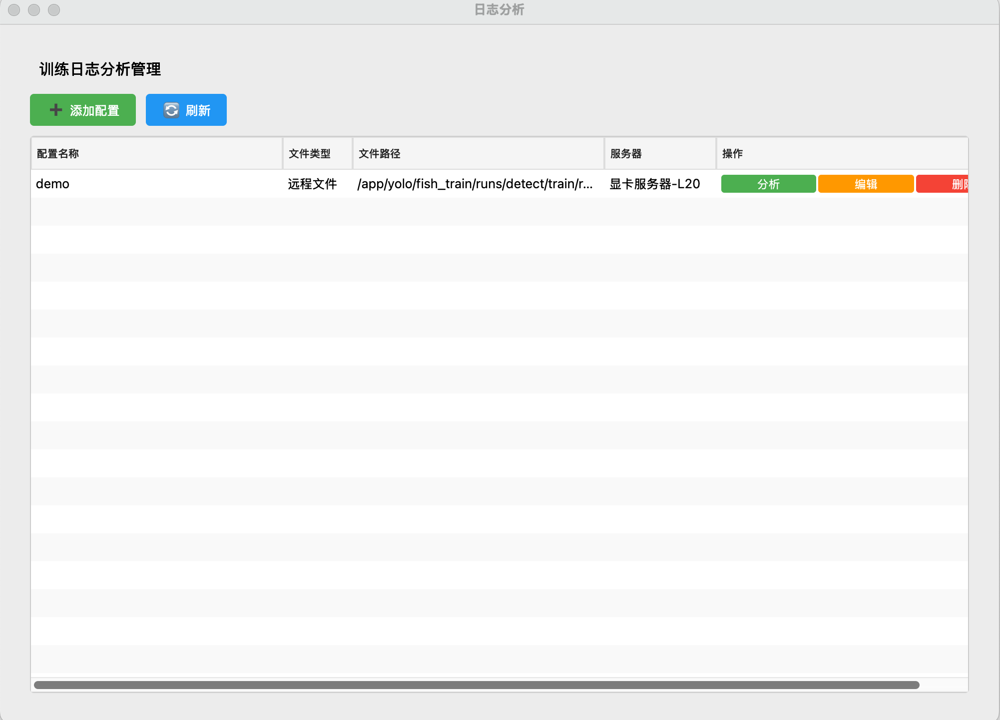

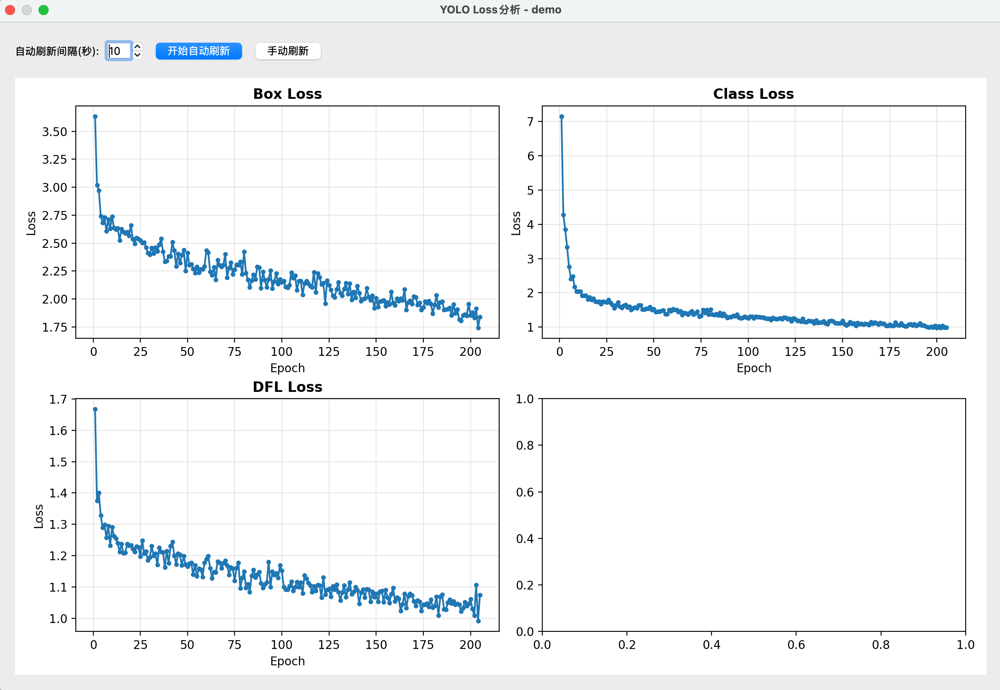

## 源码地址

**https://github.com/hyqf98/dataset_manager.git**
